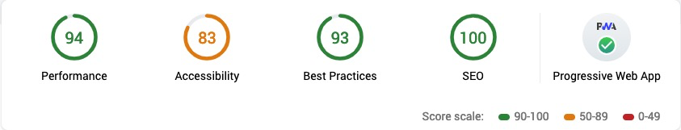

#  Arcadia

Deployed on Heroku:  **[http://arcadiagames.ga](https://arcadiagames.herokuapp.com)**

## About

Arcadia is an online game store for JavaScript games. 
> Developed as a project for the Web Software Development course CS-C3170 2018-2019 at Aalto University, Finland.

The service has two types of users: players and developers. Developers can add their games to the service and set a price for it. Players can buy games on the platform and then play the purchased games. And developers can also act as players. Win-Win.

### Team

	57237L Henri Ahti       
	721936 Siddhant Gupta
	528142 Santeri Volkov   

### Specifications

+ The service is made using [Django framework](https://www.djangoproject.com). 
+ The mockup payment service API is provided by Aalto University.
+ 3rd party login enabled for GitHub, Google and Twitter.
+ IDE: JetBrains PyCharm Professional (Education license).
+ Git version control: [Aalto University](https://version.aalto.fi)
+ Languages: Python3, HTML5, CSS, JavaScript
+ Font: [Montserrat](https://fonts.googleapis.com/css?family=Montserrat)
+ Design library: [Bootstrap 4](http://getbootstrap.com)
+ JS Library: [JQuery](http://jquery.com), [Bootstrap](http://getbootstrap.com), [ShareThis](https://www.sharethis.com)
+ Other requirements (requirements.txt):

		dj-database-url==0.5.0
		Django==2.1.7
		django-heroku==0.3.1
		gunicorn==19.9.0
		whitenoise==4.1.2
		psycopg2-binary==2.7.6.1
		python-decouple==3.1
		django-macros==0.4.0
		djangorestframework==3.9.1
		django-progressive-web-app==0.1.1
		social-auth-app-django==3.1.0

## Service Features

- The service allows user to register as a player or developer, which later can be changed.
- Developer can submit games to the service and see the sales. (Read more below)
- Players and buy and play games. High scores are avaible if the game supports it.  (Read more below)

### Mandatory Features / Points

#### Authentication / 200
- Login, logout and registration is implemented (both player and developer) using Django auth framework
- Email validation for development environment is implemented using console SMTP backend
- Email validation for production environment is implemented using Google SMTP and emails are sent to users from arcadiagames.ga@gmail.com
- The token created for email account activation link is implemented using PasswordResetTokenGenerator
- Once the registered user clicks the activation link in the email if the token is matched the user is activated and email confirmation is stored in the database

#### Basic player functionalities / 300
- Player can purchase the games via the [Simple Payments](http://payments.webcourse.niksula.hut.fi/) service integration
- Player can play games. The games are loaded in an iFrame on the Game page.
- Players are only allowed to play the games that they have purchased respectively.
- The service has **Explore** (homepage) which showcases all the games available on the Store. Users can filter the games with search, or by genres, or by whether the game is free or not.
- The service also has **Library** which showcases all the purchased games. It also allows filtering by search, genres and if-free. Library can also sort games alphabetically (A-Z or Z-A).
- Player can see all their transactions and money spent in their **Profile**.

#### Basic developer functionalities / 200
- Developer can submit a game, with a Name, Description, Genre, Image-URL, Price and Game-URL. Once submitted, only that developer can edit the game details or remove the game from store.
- Developer can see sales statistics (charts and graphs) of all games in the **Dev Center**. All transactions can be seen in the **Profile** Area, with details like Date, Game, Player, Amount and Payment_result.
- A developer can only add games to his/her respective profile, and then only he/she can modify/remove the game. 
- Developers can play their own submitted games without purchasing them.
- Games can also be submitted for 0 price which will make the game *Free to Play*.

#### Game/service interaction / 200

A game optimised for Arcadia, should send a `postMessage` to parent window containing a `messageType` and associated data. The service listens for these messages and reacts accordingly. 
The messages are processed using AJAX, so there is no need to refresh the page. The supported message-types are: 

- `SETTING`: Arcadia expects this message from all games optimised for the service. Failure to deliver the message may cause Arcadia to block certain UI elements and revert to defaults. 
The message should contain `options` which can contain some data like in the following sample:
			
		options: {
			width: 500,		//integer, width of the game-frame in pixels
			height: 400,	//integer, height of the game-frame in pixels
			score: True,	//boolean, if game supports scoring
			save: True,		//boolean, if game supoorts saving/loading
			mobile: False,	//boolean, if game is mobile-friendly
		}

- `SCORE`: If service receives this message with valid `score`, then it records the score in the game's leaderboard (high-scores). Expected when game is finished or user submits score.
	- 	`SCORE_UPDATE`: A secondary & similar message which lets service know current score without submitting scores. 
	This is used to display current score and check if user beat the high-score, but the score is not saved anywhere, until `SCORE` message is received.
- `SAVE`: If service receives this message with valid `gameState`, then the service saves the state which can retrieved later.
- `LOAD_REQUEST`: If service receives this message, it returns the last save-game (if any) to the game as `LOAD` message, otherwise sends back an `ERROR` message.

#### Quality of Work / 100
- **Santeri (quality of code, use of framework)** give example of using include feature for nav and search
- During the project the service was extensively tested manually on both mobile and desktop platforms
- Basic automated tests implemented to test all the models  
- Arcadia focuses a lot on user-experience. The following points are to considered:
	- The website is styled with friendly colours with a well-defined layout. **Google Lighthouse** test gave the site overall great scores (see image).  
	- The website is mobile responsive and supports Progressive Web-App (PWA), which means it can be installed as an app via Chrome browser on Android mobile.
	- Store can be explored without logging in and game information is available without logging-in or purchasing the game.
	- Store allows to filter games in multiple ways.
	- Explore page also showcases top developers with most-submitted games. Logged-in users can check their public profile and see the games they have submitted.
	- Pagination is possible in Explore, Library & Dev Center. But page-navigation is hidden if there is only one page.
	- Library & Dev Center shows more data about each game like high-score & last-save in Library and sales-statistics in Dev Center.
	- Profile section allows user to see and update their profile. It also shows transaction history.
	- The Game page shows info about game, developer, and highscores. Along with the game (when purchased), there is data like Current Score and Updates. User can see all scores by expanding Leaderboard.
	- There are many more quirks here and there which will make the experience better on any device.
	
### Extra Features / Points

#### Save/load and resolution feature / 100
- The service has complete support for setting frame resolution as requested by game.
- The service saves a valid gameState and loads the latest save when requested.

#### 3rd party login / 100
- 3rd party login was implemented via social-auth-app-django library which uses Oauth, and allows users to login with various social accounts. 
- Github, Google, and Twitter are used for this project. 
- When the users login to the site for the first time a new player profile is created and tied to their social account with their names, email and profile picture. 
- One exception was that twitter won't let us use the email of their users without us having our own privacy policy and terms of service. 
- For the profile picture part we added a new step to the pipeline to fetch the picture urls from all the services.

#### RESTful API / 100
- On top of game/service internal APIs full RESTful API is implement using Django REST Framework [Arcadia DRF API](https://arcadiagames.herokuapp.com/api/v1/)
- All the models are accessible through the API
- The API is not public. To demonstrate the API in web browser it is configured to use session based authentication and accessible by admin users only
- To provide API access to individual developer users DRF is easy to configure to use e.g. token based authentication

#### Own game / 100
- We made a basic game '[XO](https://arcadiagames.herokuapp.com/game/7/)' which is Noughts-&-Crosses, offered for free on Store. The game communicates the settings, score, and save_games. It is included in repository under `/app/static/game/`

#### Mobile Friendly / 50
- The website is completely mobile-friendly. It contains the `viewport` meta-tag and is optimised to run on any screen size.
- Bootstrap is NOT used for this. The website has a grid template which changes arrangements on elements depending on window width. 
- The website is tested on Full HD desktops, TV, 13' Notebook, iPad, and multiple smartphones.

#### Social media sharing / 50
- Each page or game can be shared over social media / IM as it contains OpenGraph meta-tags.
- Default tags describe the service but if a game is shared, then game's information is shared instead of default.
- The sharing works without logging-in as the game-page is accessible without authentication.
- We use ShareThis API to create share options for multiple services like Facebook, Twitter, WhatsApp, etc.

## Models and Views

### Models

##### AbstractUser (Django)
Abstract version of Django's basic User model

	(username, first_name, last_name, email, password, is_active, ...)  

##### User(AbstractUser)  
Modified AbstractUser to include players inventory, experience/loyalty points
and profile image fields as well as developer and email verification boolean fields
into Django's User model

    (inventory, points_level, image, is_dev, email_confirmed)  

##### Game  
Model for website's games. Games are hosted behind developer provided https secured urls

	(developer, genre, url, price, name, image, description, high_score, is_active)  

##### Genre  
Refers to a particular type or style of a game

	(name)  

##### Transaction 
Model for the game purchase transactions to gather data for sales statistics
and to verify users' owned games

	(player, game, amount, timestamp, payment_reference, payment_result)  

##### GameState 
Model for saving the gamestate send by the game and to bind the gamestate
to a player and a game

	(player, game, gameState, saveDate)  

##### GameScore  
Model for saving scores from games, to distinguish the score from the gamestate,
for when only the score is submitted, and also to get access to the global
high scores of the games

	(player, game, score, scoreDate)  

### Views

#### Public Views (No Login Required)

##### Generic Views

- `index_view` // Homepage
- `base_layout` // Used for PWA

##### Unauthorised API

- `game_api_all` // Send all games as JSON (without actual game-URL)
- `game_api_latest` // Send latest game (without actual game-URL), used to show latest game when logging-in

##### Registration

- `signup_view` // Registration page
- `account_activation_sent` // Shows message 'mail sent'
- `activate` // Check for account validation

##### Games

- `explore_view` // Explore all games
- `game_play_view` // See game details (and play if authenticated and purchased)

#### Private Views (Login required as Player or Developer)

##### User Profile

- `library_view` // Shows purchased games to Players and submitted games to Devs.
- `profile` // Show user profile
- `profile_edit_view` // Allow user to edit profile
- `external_profile_view` // Show's public profile of an active user

##### Payment Views

- `pay_purchase_view` // shows purchase form
- `payment_result_view` // checks if payment successful

##### Game Views (Login required as Developer Only)

- `game_add_view` // Form to submit game
- `game_edit_view` // Form to edit game
- `game_delete_view` // Option to archive game

---
![alt text][Model relations]

## Working practices
- Telegram was our main channel for communication and collaboration
- We used Aalto's Gitlab as code repository
- We divided the project into week long sprints and met once a week to plan and collaborate

## Process and Time Schedule plan
WEEK 51-52
1. Heroku setup (Santeri)
2. Django basic setup (Henri)
    - one app
    - development configuration with SQLLite
    - production configuration with Postgres
    - required middleware for Authentication etc.
    - check / configure default template system used
3. Implement the first models (User(Django), DeveloperProfile, 
PlayerProfile, Transactions, Game, GameState (settings, 
game_state) (Henri)
4. Initial website deign (Siddhant)

WEEK 1 Sprint
- Registration page
- Login page
- Email validation / SMTP sending from Django

WEEK 2 Sprint
- test data population (Santeri)
- model diagram update (Santeri)
- revised model implementation & migration (Henri)
- Django Groups into use (Henri)
- GamePlayView (Siddhant)
- ProfileView (Siddhant)
- GameBrowserView (Siddhant)
- message_SCORE(and all other game-service messages) (Siddhant)

WEEK 3 Sprint
- Email validation (Henri)
- payment service integration (Henri)
- Get inventory working (Santeri)
- test data population and some unit tests (Santeri)
- save for GameForm (Santeri)
- save game messages (Santeri)
- ModifyGameView (Siddhant)
- GameDetailView (Siddhant)
- SocialSharing (Siddhant)

WEEK 4 Sprint
- Post message from Template to View (Siddhant)
- Delete Game (Siddhant)
- Update Model-Game (Santeri)
- Settings separation (Santeri)

WEEK 5 Sprint
- Highscores (Game & library) - (Siddhant)
- sales statistics (Siddhant)
- Testing Python files (Henri)
- RestfulAPI (Henri)
- Linting - (Santeri)
- 3rd party Login (Santeri)
- Security (https enforcing and other django settings):  
https://observatory.mozilla.org/analyze/arcadiagames.herokuapp.com

WEEK 6 Sprint
- Testing
- Commenting
- Reporting

WEEK 7 Sprint
- Testing
- Commenting
- Reporting 

Final date 19th of Feb

[Model relations]: app/static/media/arcadia.png "Model relations"
